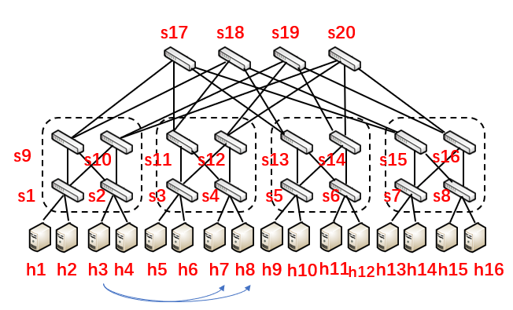

Fat-Tree 路由图：



路由设计代码 `LPR.py, LSR.py, LLR.py` 以及流量生成代码 `parallel_traffic_generator.py, sequential_traffic_generator.py` 在 `RyuRoute` 目录下。

 `LPR.py, LSR.py, LLR.py` 三者结构基本相同，区别主要在 `get_port` 函数（该函数根据当前节点以及目的 IP 地址查找下一个节点的端口号）

### LPR

用两个进程运行命令：

```bash
ryu-manager LPR.py --observe-links > LPR_out.txt
sudo python3 parallel_traffic_generator.py
```

将在 `LPR_out.txt` 中得到 h3->h7 和 h3->h8 的首包路径：

格式为 `ethertype src_ip -> dst_ip : dpid in_port out_port`

```
2054 10.0.0.3 -> 10.0.0.7 :  2 1 -> 3
2054 10.0.0.3 -> 10.0.0.7 :  9 2 -> 3
2054 10.0.0.3 -> 10.0.0.7 :  17 1 -> 2
2054 10.0.0.3 -> 10.0.0.7 :  11 3 -> 2
2054 10.0.0.3 -> 10.0.0.7 :  4 3 -> 1
2054 10.0.0.3 -> 10.0.0.8 :  2 1 -> 3
2054 10.0.0.3 -> 10.0.0.8 :  9 2 -> 3
2054 10.0.0.3 -> 10.0.0.8 :  17 1 -> 2
2054 10.0.0.3 -> 10.0.0.8 :  11 3 -> 2
2054 10.0.0.3 -> 10.0.0.8 :  4 3 -> 2
2048 10.0.0.3 -> 10.0.0.7 :  2 1 -> 3
2048 10.0.0.3 -> 10.0.0.7 :  9 2 -> 3
2048 10.0.0.3 -> 10.0.0.7 :  17 1 -> 2
2048 10.0.0.3 -> 10.0.0.7 :  11 3 -> 2
2048 10.0.0.3 -> 10.0.0.8 :  2 1 -> 3
2048 10.0.0.3 -> 10.0.0.7 :  4 3 -> 1
2048 10.0.0.3 -> 10.0.0.8 :  9 2 -> 3
2048 10.0.0.3 -> 10.0.0.8 :  17 1 -> 2
2048 10.0.0.3 -> 10.0.0.8 :  11 3 -> 2
```

> 其中 2054 是 ARP 包，2048 是 IP 包

> 运行结束后，需手动中止前一个进程

### RSR

类似地，用两个进程运行命令：

```bash
ryu-manager RSR.py --observe-links > RSR_out.txt
sudo python3 parallel_traffic_generator.py
```

将在 `RSR_out.txt` 中得到 h3->h7 和 h3->h8 的首包路径：

```
2054 10.0.0.3 -> 10.0.0.7 :  2 1 -> 3
2054 10.0.0.3 -> 10.0.0.7 :  9 2 -> 4
2054 10.0.0.3 -> 10.0.0.8 :  2 1 -> 3
2054 10.0.0.3 -> 10.0.0.7 :  18 1 -> 2
2054 10.0.0.3 -> 10.0.0.8 :  9 2 -> 4
2054 10.0.0.3 -> 10.0.0.7 :  11 4 -> 2
2054 10.0.0.3 -> 10.0.0.8 :  18 1 -> 2
2054 10.0.0.3 -> 10.0.0.7 :  4 3 -> 1
2054 10.0.0.3 -> 10.0.0.8 :  11 4 -> 2
2054 10.0.0.3 -> 10.0.0.8 :  4 3 -> 2
2048 10.0.0.3 -> 10.0.0.7 :  2 1 -> 3
2048 10.0.0.3 -> 10.0.0.7 :  9 2 -> 3
2048 10.0.0.3 -> 10.0.0.8 :  2 1 -> 4
2048 10.0.0.3 -> 10.0.0.8 :  10 2 -> 4
2048 10.0.0.3 -> 10.0.0.8 :  20 1 -> 2
2048 10.0.0.3 -> 10.0.0.7 :  17 1 -> 2
2048 10.0.0.3 -> 10.0.0.8 :  12 4 -> 2
2048 10.0.0.3 -> 10.0.0.8 :  4 4 -> 2
2048 10.0.0.3 -> 10.0.0.7 :  11 3 -> 2
```

### LLR

用两个进程运行命令：

```bash
ryu-manager LLR.py --observe-links > LLR_out.txt
sudo python3 sequential_traffic_generator.py
```

将在 `LLR_out.txt` 中得到前 10 条首包路径：

```
2054 10.0.0.1 -> 10.0.0.5 :  1 1 -> 3
2054 10.0.0.1 -> 10.0.0.5 :  9 1 -> 3
2054 10.0.0.1 -> 10.0.0.5 :  17 1 -> 2
2054 10.0.0.1 -> 10.0.0.5 :  11 3 -> 1
2054 10.0.0.1 -> 10.0.0.5 :  3 3 -> 1
2054 10.0.0.5 -> 10.0.0.1 :  3 1 -> 4
2054 10.0.0.5 -> 10.0.0.1 :  12 1 -> 3
2054 10.0.0.5 -> 10.0.0.1 :  19 2 -> 1
2054 10.0.0.5 -> 10.0.0.1 :  10 3 -> 1
2054 10.0.0.5 -> 10.0.0.1 :  1 4 -> 1
2048 10.0.0.1 -> 10.0.0.5 :  1 1 -> 3
2048 10.0.0.1 -> 10.0.0.5 :  9 1 -> 3
2048 10.0.0.1 -> 10.0.0.5 :  17 1 -> 2
2048 10.0.0.1 -> 10.0.0.5 :  11 3 -> 1
2048 10.0.0.1 -> 10.0.0.5 :  3 3 -> 1
2054 10.0.0.1 -> 10.0.0.6 :  1 1 -> 4
2054 10.0.0.1 -> 10.0.0.6 :  10 1 -> 3
2054 10.0.0.1 -> 10.0.0.6 :  19 1 -> 2
2054 10.0.0.1 -> 10.0.0.6 :  12 3 -> 1
2054 10.0.0.1 -> 10.0.0.6 :  3 4 -> 2
2054 10.0.0.6 -> 10.0.0.1 :  3 2 -> 3
2054 10.0.0.6 -> 10.0.0.1 :  11 1 -> 3
2054 10.0.0.6 -> 10.0.0.1 :  17 2 -> 1
2054 10.0.0.6 -> 10.0.0.1 :  9 3 -> 1
2054 10.0.0.6 -> 10.0.0.1 :  1 3 -> 1
2048 10.0.0.1 -> 10.0.0.6 :  1 1 -> 4
2048 10.0.0.1 -> 10.0.0.6 :  10 1 -> 3
2048 10.0.0.1 -> 10.0.0.6 :  19 1 -> 2
2048 10.0.0.1 -> 10.0.0.6 :  12 3 -> 1
2048 10.0.0.1 -> 10.0.0.6 :  3 4 -> 2
2054 10.0.0.2 -> 10.0.0.6 :  1 2 -> 3
2054 10.0.0.2 -> 10.0.0.6 :  9 1 -> 3
2054 10.0.0.2 -> 10.0.0.6 :  17 1 -> 2
2054 10.0.0.2 -> 10.0.0.6 :  11 3 -> 1
2054 10.0.0.2 -> 10.0.0.6 :  3 3 -> 2
2054 10.0.0.6 -> 10.0.0.2 :  3 2 -> 4
2054 10.0.0.6 -> 10.0.0.2 :  12 1 -> 3
2054 10.0.0.6 -> 10.0.0.2 :  19 2 -> 1
2054 10.0.0.6 -> 10.0.0.2 :  10 3 -> 1
2054 10.0.0.6 -> 10.0.0.2 :  1 4 -> 2
2048 10.0.0.2 -> 10.0.0.6 :  1 2 -> 3
2048 10.0.0.2 -> 10.0.0.6 :  9 1 -> 3
2048 10.0.0.2 -> 10.0.0.6 :  17 1 -> 2
2048 10.0.0.2 -> 10.0.0.6 :  11 3 -> 1
2048 10.0.0.2 -> 10.0.0.6 :  3 3 -> 2
2054 10.0.0.2 -> 10.0.0.7 :  1 2 -> 4
2054 10.0.0.2 -> 10.0.0.7 :  10 1 -> 3
2054 10.0.0.2 -> 10.0.0.7 :  19 1 -> 2
2054 10.0.0.2 -> 10.0.0.7 :  12 3 -> 2
2054 10.0.0.2 -> 10.0.0.7 :  4 4 -> 1
2054 10.0.0.7 -> 10.0.0.2 :  4 1 -> 3
2054 10.0.0.7 -> 10.0.0.2 :  11 2 -> 3
2054 10.0.0.7 -> 10.0.0.2 :  17 2 -> 1
2054 10.0.0.7 -> 10.0.0.2 :  9 3 -> 1
2054 10.0.0.7 -> 10.0.0.2 :  1 3 -> 2
2048 10.0.0.2 -> 10.0.0.7 :  1 2 -> 4
2048 10.0.0.2 -> 10.0.0.7 :  10 1 -> 3
2048 10.0.0.2 -> 10.0.0.7 :  19 1 -> 2
2048 10.0.0.2 -> 10.0.0.7 :  12 3 -> 2
2048 10.0.0.2 -> 10.0.0.7 :  4 4 -> 1
2054 10.0.0.3 -> 10.0.0.7 :  2 1 -> 3
2054 10.0.0.3 -> 10.0.0.7 :  9 2 -> 3
2054 10.0.0.3 -> 10.0.0.7 :  17 1 -> 2
2054 10.0.0.3 -> 10.0.0.7 :  11 3 -> 2
2054 10.0.0.3 -> 10.0.0.7 :  4 3 -> 1
2054 10.0.0.7 -> 10.0.0.3 :  4 1 -> 4
2054 10.0.0.7 -> 10.0.0.3 :  12 2 -> 3
2054 10.0.0.7 -> 10.0.0.3 :  19 2 -> 1
2054 10.0.0.7 -> 10.0.0.3 :  10 3 -> 2
2054 10.0.0.7 -> 10.0.0.3 :  2 4 -> 1
2048 10.0.0.3 -> 10.0.0.7 :  2 1 -> 3
2048 10.0.0.3 -> 10.0.0.7 :  9 2 -> 3
2048 10.0.0.3 -> 10.0.0.7 :  17 1 -> 2
2048 10.0.0.3 -> 10.0.0.7 :  11 3 -> 2
2048 10.0.0.3 -> 10.0.0.7 :  4 3 -> 1
2048 10.0.0.5 -> 10.0.0.1 :  3 1 -> 3
2048 10.0.0.7 -> 10.0.0.2 :  4 1 -> 4
2048 10.0.0.6 -> 10.0.0.2 :  3 2 -> 4
2048 10.0.0.5 -> 10.0.0.1 :  11 1 -> 4
2048 10.0.0.7 -> 10.0.0.2 :  12 2 -> 3
2048 10.0.0.6 -> 10.0.0.2 :  12 1 -> 4
2048 10.0.0.6 -> 10.0.0.1 :  3 2 -> 3
2048 10.0.0.5 -> 10.0.0.1 :  18 2 -> 1
2048 10.0.0.6 -> 10.0.0.2 :  20 2 -> 1
2048 10.0.0.7 -> 10.0.0.2 :  19 2 -> 1
2048 10.0.0.7 -> 10.0.0.3 :  4 1 -> 4
2048 10.0.0.7 -> 10.0.0.3 :  12 2 -> 3
2048 10.0.0.6 -> 10.0.0.1 :  11 1 -> 4
2048 10.0.0.6 -> 10.0.0.2 :  10 4 -> 1
2048 10.0.0.5 -> 10.0.0.1 :  9 4 -> 1
2048 10.0.0.7 -> 10.0.0.2 :  10 3 -> 1
```
